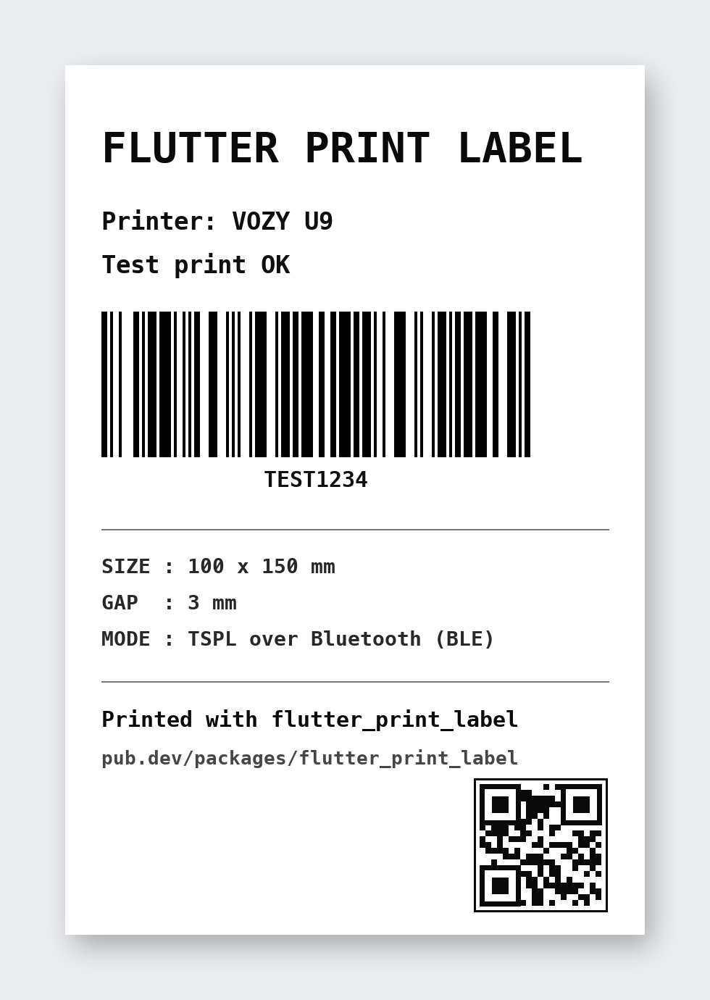

# flutter_print_label

Bluetooth label printer plugin (TSPL) for Android and iOS.



Built for real-world budget label printers — VOZY, Xprinter, Gprinter and
similar Chinese thermal printers used for shipping labels — including the
quirks that usually make them hard to use from Flutter:

- **Finds printers that advertise BLE without a name.** Many cheap printers do
  this; most plugins silently skip them. This plugin reports them with a
  generated name like `Unknown (1A2B)` so they can be listed and selected.
- **Works with non-standard write services.** After connecting (iOS), every
  service/characteristic is discovered and the first writable characteristic
  is picked, preferring well-known printer services (`49535343-...`, `FF00`,
  `FFE0`, `18F0`, ...). No vendor SDK required — pure CoreBluetooth.
- **Chunked writes.** Data is written in MTU-sized chunks with a short delay,
  so large payloads (bitmap labels) don't overflow the printer's BLE buffer.
- **Stable connect/disconnect cycles.** One central manager for the app's
  lifetime; disconnecting really drops the link so the printer starts
  advertising again and can be re-discovered without power-cycling it.
- **Android dual transport.** Bluetooth Classic (SPP) for paired printers and
  a real BLE scan for unpaired ones.
- `connected` is only reported when the printer is actually ready to receive
  data (iOS: a writable characteristic has been found).

## Getting started

### iOS

Add to `ios/Runner/Info.plist`:

```xml
<key>NSBluetoothAlwaysUsageDescription</key>
<string>Need Bluetooth access to connect to label printers</string>
<key>UIBackgroundModes</key>
<array>
    <string>bluetooth-central</string>
</array>
```

Do **not** pair the printer in Settings > Bluetooth on iOS — just scan and
connect from the app.

### Android

All required permissions are declared by the plugin and requested at runtime
automatically (`BLUETOOTH_SCAN` / `BLUETOOTH_CONNECT` on Android 12+,
location permission on older versions). When Bluetooth is off, the system
"enable Bluetooth" dialog is shown automatically on scan.

## Usage

```dart
import 'dart:io';
import 'package:flutter_print_label/flutter_print_label.dart';

final printer = FlutterPrintLabel.instance;

// 1. Scan.
// iOS always scans BLE. On Android, isBle: false returns the paired-devices
// list; isBle: true performs a real BLE scan (finds unpaired printers too).
printer.scan(isBle: Platform.isIOS).listen((device) {
  print('found: ${device.name} (${device.address})');
});

// 2. Connect, then wait for `connected`.
await printer.connect(device);
printer.connectionStatus.listen((status) {
  if (status == PrinterConnectionStatus.connected) {
    print('ready to print');
  }
});

// 3. Print a TSPL label (100 x 150 mm shipping label).
await printer.printTspl(
  'SIZE 100 mm,150 mm\r\n'
  'GAP 3 mm,0 mm\r\n'
  'DIRECTION 1\r\n'
  'CLS\r\n'
  'TEXT 50,80,"3",0,2,2,"HELLO"\r\n'
  'BARCODE 50,320,"128",100,1,0,2,2,"123456789"\r\n'
  'PRINT 1,1\r\n',
);

// Raw bytes work too (e.g. TSPL BITMAP payloads):
await printer.sendBytes(bytes);

// Disconnect when done.
await printer.disconnect();
```

### Handling unnamed printers

Devices without a name are emitted as `Unknown (xxxx)` / `Printer (xxxx)`.
A common UX is to hide them behind a "show unnamed devices" toggle, but always
show the device the user previously selected (match by `address`).

### iOS extras

```dart
// After a hot restart the native connection may still be alive while your
// Dart state is gone (and a connected printer stops advertising, so scanning
// won't find it). Restore it:
final connected = await printer.getConnectedDevice();

// React to the Bluetooth radio being switched off, and help the user turn it
// back on (shows the system alert whose Settings button opens the Bluetooth
// settings page):
printer.bluetoothOnStream.listen((on) { /* update UI */ });
await printer.showEnableBluetoothAlert();
```

## TSPL quick reference

| Command | Meaning |
|---|---|
| `SIZE 100 mm,150 mm` | Label size |
| `GAP 3 mm,0 mm` | Gap between labels |
| `CLS` | Clear the image buffer |
| `TEXT x,y,"font",rotation,x-mul,y-mul,"content"` | Draw text |
| `BARCODE x,y,"128",height,readable,rotation,narrow,wide,"content"` | Draw barcode |
| `BITMAP x,y,widthBytes,height,mode,data` | Draw bitmap (for images/PDF rasters) |
| `PRINT 1,1` | Print |

## Credits

Based on [flutter_pos_printer_platform](https://pub.dev/packages/flutter_pos_printer_platform)
(MIT, © 2022 Gustavo Morales). The iOS side has been rewritten from scratch in
pure CoreBluetooth; the Android side keeps its battle-tested SPP/GATT
implementation with fixes for unnamed BLE devices.
